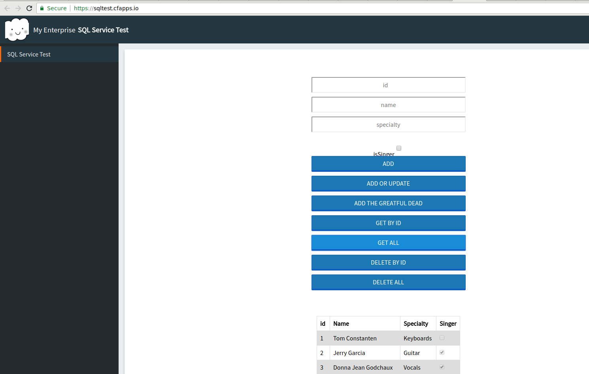

# PCFMySql
PCF application that will interact with a SQL database
had to do some shifty stuff to get this app to boot without a datasource connected, but i wanted the UI to still come up; then fail. So it tries to create the tables on a @PostConstruct

